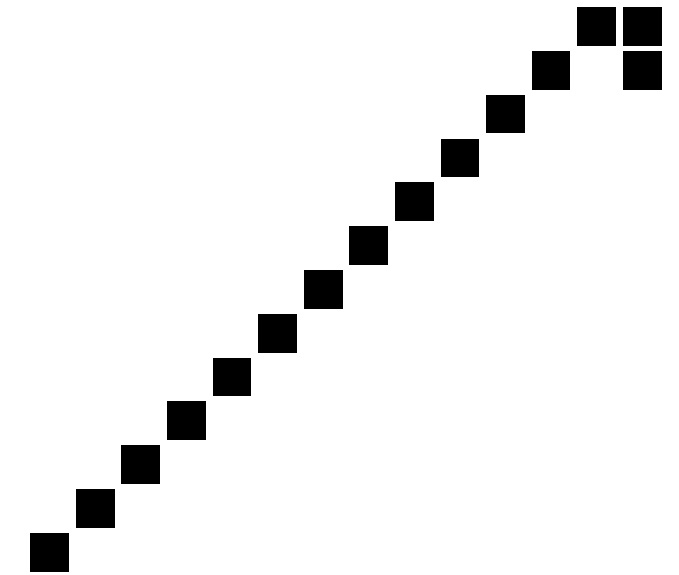

```{r setup, include = FALSE}
knitr::opts_chunk$set(echo = TRUE)
```

\tableofcontents


\AddToShipoutPictureBG*{%
  \AtPageLowerLeft{%
    \hspace{\paperwidth}%
    \raisebox{\baselineskip}{%
      \makebox[0pt][r]{Vysázeno pomocí \textsf{R}-ka a \TeX-u \quad}
}}}


\section{Synopse}

Aplikace \textsf{Conwayova\_hra\_zivota} (dále jen aplikace), je implementací dvourozměrného celulárního automatu, který má simulovat vývoj společenství živých buněk v čase. Aplikace je napsána téměř výhradne v jazyce \textsf{R}, což je vývojové prostředí a interpretovaný jazyk primárně určený především pro statistické výpočty a následné vizualizace; je však možné jej využít i pro komplexní programátorské úlohy. S využitím balíčku \verb#Shiny#, který vytváří webový framework nad čistým kódem psaným v jazyce \textsf{R}, je možné vytvářet i relativně netriviální webové aplikace -- tímto postupem byla vytvořena i předložená aplikace. Některé funkcionality byly přidány pomocí javascriptu (\verb#.js#) či kaskádových stylů (\verb#.css#), smyslem však bylo jen aplikaci uživatelsky zpříjemnit; samotná aplikace by byla online funkční i jen s použitím jazyka \textsf{R}. Aplikace má kromě své desktopové verze i online verzi dostupnou na

\begin{center}
  \href{http://shiny.statest.cz:3838/Conwayova\_hra\_zivota/}{http://shiny.statest.cz:3838/Conwayova\_hra\_zivota/}.
\end{center}

Předložený text nabízí stručný úvod do celulárního automatu Hra života, dále popisuje základní prvky ovládání aplikace a technickou charakteristiku, na konci textu jsou uvedeny zdrojové kódy všech částí aplikace.


\section{Conwayova hra života jako celulární automat}

Conwayova hra života, běžně zvaná jen \textit{Hra života} či jen \textit{Život}, je známý dvourozměrný celulární automat, který má svým chováním připomínat vývoj kolonie konečného počtu jednoduchých (jednobuněčných) živých organismů (buněk) v čase. Na počátku je dána pouze iniciální konfigurace rozestavení (a počtu) buněk a systém jednoduchých a neměnných pravidel, které říkají, za jakých podmínek může mrtvá buňka oživnou a naopak. Konfigurace je v každém časovém okamžiku prezentována maticí, kdy hodnoty matice rovné $1$ představují buňky, jež jsou v daném okamžiku živé, a hodnoty matice rovné $0$ představují naopak ty, které jsou v daném okamžiku mrtvé. Vývoj konfigurace a počtu žijících buněk v dalších časových okamžicích, kdy čas je chápán diskrétně, je iterativně aktualizován pro každou buňku matice podle daných pravidel, tím pádem je již plně determinován. Dopředu je však vývoj pro velkou část vstupních konfigurací nevypočitatelný, je tedy nutné jej krok po kroku simulovat.

Myšlenka celulárních automatů se datuje do roku 1940, kdy první koncepty navrhl známý maďarský matematik John von Neumann ve snaze vytvořit stroj, který by repdoukoval sám sebe. Implementace automatů vša tou dobou narážela na omezené možnosti výpočetní techniky, proto zájem o další vývoj opadl a byl oživen až v 70. letech. Autorem samotné \textit{Hry života} je britský matematik John Horton Conway, emeritní profesor na Princetonské univerzitě, který precisoval její pravidla v roce 1970. Díky relativně snadné uchopitelnosti konceptu \textit{Hry života} se získal tento typ celulárního automatu oblibu i mimo vědeckou komunitu -- vnikaly různé výzvy o tvorbu iniciální konfigurace buněk s nějakou \textit{danou} vlastností, kterých se účastnila i široká veřejnost. Díky zájmu o \textit{Hru života} vznikl i časopis věnovaný přímo problematice diskrétního celulárního automatu. Zajímavými se tehdy jevily především tyto dvě otázky, obě vyslovil sám Conway: 

\begin{enumerate}
  \item Existuje nějaká (vstupní) konečná konfigurace buněk, která může neomezeně růst (velikostí, ne nutně počtem buněk), i nad limity dané velikostí mřížky? Pro větší mřížku tedy konfigurace dosáhne opět hranic mřížky.
  \item Existuje nějaká konečná konfigurace buněk, která se vyskytuje pouze v druhé generaci a poté již ne? Jde též o problém zvaný \textit{The Grandfather Problem}.
\end{enumerate}

Pro první otázku byly takové konfigurace již nalezeny, autorem jedné z nich je William Gosper; jeho konfigurace řešící první otázku je nazývána \textit{Gosper glider gun}, česky nejspíše \textit{Gosperovo křídlové dělo}; to je mimochodem implementováno i v naší aplikace (viz dále). Na druhou otázku není známá odpověď dodnes.

Zajímavých otázek a výzkumných problémů je celá řada -- jsou například zkoumány konfigurace, které mají právě $k$ různých stavů, jež se periodicky střídají (s periodou $k$); tedy že dva stavy konfigurace v okamžicích $i$ a $i + k$ pro všechna $i \in \mathbb{Z}_{0}^{+}$ a dané $k \in \mathbb{N}$ jsou zcela shodné.

V průběhu každé konkrétní hry (tedy pro danou iniciální konfiguraci buněk) mohou vznikat různě komplexní sestavy buněk. I přes jednoduchá pravidla je složitost vznikajících sestav buněk a složitost změn mezi jendotlivými sousedními časovými kroky značná; v tomto smyslu jsou někdy celulární automaty považovány za diskrétní analogie spojitých komplexních nelineárních systémů, které studuje nelineární dynamika (z této oblasti pochází populárně známé pojmy jako \textit{chaos} či \textit{butterfly-wing effect}).

Některé iniciální či vzniklé sestavy buněk mají naopak chování (tedy vývoj v čase) dobře predikovatelné, mnohdy bylo spočítáno a známo dřív, než byla vůbec technicky možná první solidní implementace \textit{Hry života}. Jindy bylo pozorování vypozorováno až empiricky sledováním vývoje dané hry. Kategorie některých sestav buněk podle typu chování (tzv. \textit{tvary}) budou probrány dále.

Celulární automaty obecně jsou aplikovány jako modely v experimentální fyzice či biologii, díky vztahům mezi jednoduchými a komplexními konfiguracemi pomocí jednoduchých pravidel lze celulární automaty použít i v kompresi dat, např. v některých zvukových formátech.


\subsection{Prostor a pravidla hry}

Prostorem hry je dvourozměrná matice, též nazývaná mřížka. V reálných simulacích včetně naší musíme obvykle vystačit s konečnou mřížkou; hypoteticky lze ale uvažovat i nekonečně velkou dvourozměrnou matici. Hodnotami matice jsou obecně jedničky, resp. nuly představující živé, resp. mrtvé buňky. Rozestavení živých (a mrtvých) buněk na mřížce se nazývá konfigurace či vzor nebo tvar. Čas je vnímán diskrétně, okamžik $0$ odpovidá iniciálnímu (vstupnímu) stavu, pro každý přechod do následujícího okamžiku je podle daných pravidel (podle tzv. \textit{přechodové funkce}) pro každou buňku spočítáno, jestli bude i v následujícím okamžiku živá, či mrtvá. O tom v zásadě rozhoduje to, zda je buňka v daném okamžiku živá a jaký je počet živých buněk v jejím těsném okolí (tj. v osmici polí matice, které sousedí s danou buňkou alespoň rohem)\footnote{Snadno nahlédneme, že u mřížek (matic) s konečnými rozměry může docházet k tzv. okrajovým fenoménům, kdy buňky sousedící s hranou matice, či přímo v buňky v rozích matice nemají kompletní okolí tvořené osmi buňkami a jejich chování se může lišit od původní představy.}. Probíhá-li \textit{Hra života} na matici $m \times n$, pak je počet všech navzájem možných konfigurací, do kterých může hra teoreticky dojít, roven $2^{mn}$, neboť každá z $mn$ buněk je buďto živá, nebo mrtvá.

Původní pravidla přechodové funkce \textit{Hry života} definoval již v roce 1970 sám profesor Conway. Jedná se o čtveřici relativně jednoduchých pravidel:

\begin{enumerate}[(i)]
  \item Každá živá buňka s méně než dvěma živými sousedy zemře.
  \item Každá živá buňka se dvěma nebo třemi živými sousedy zůstává žít.
  \item Každá živá buňka s více než třemi živými sousedy zemře.
  \item Každá mrtvá buňka s právě třemi živými sousedy oživne.
\end{enumerate}

Postupně vznikla celá řada variací původních pravidel; především jsou diskutována taková, která zajišťují, že vývoj konfigurace v čase není dopředu předvídatelný, či zajišťují dlouhodobé přežití populace. Jejich uvedení je však nad rámec tohoto textu.

Aplikace pravidel je na jedné z možných konfigurací předvedena na obrázku \ref{fig_0}.

\begin{figure}[H]
  \centering
  \includegraphics[height=2cm]{progress.jpg}
  \caption{Vývoj jedné z možných konfigurací}\label{fig_0}
\end{figure}


\subsection{Přehled tvarů}

\begin{itemize}
\item \textbf{Zátiší (Still life).} Jedná se o stabilní konfigurace, které jsou vždy i svým vlastním rodičem, tj. ve dvou po sobě následujících okamžicích je taková konfigurace zcela totožná. Proto jsou někdy nazývány též jako invariantní formy. Patří sem např. blok (block), obrázek \ref{fig_1}, včelín (beehive),  obrázek \ref{fig_2}, bochník (loaf),  obrázek \ref{fig_3}, loď (boat), obrázek \ref{fig_4} či dvojblok (bi-block), obrázek \ref{fig_5}.

\begin{figure}[H]
\minipage{0.5\textwidth}
  \centering
  \includegraphics[height=2cm]{block.jpg}
  \caption{Blok (block)}\label{fig_1}
\endminipage\hfill
\minipage{0.5\textwidth}
  \centering
  \includegraphics[height=2cm]{beehive.jpg}
  \caption{Včelín (beehive)}\label{fig_2}
\endminipage
\end{figure}

\begin{figure}[H]
\minipage{0.5\textwidth}%
  \centering
  \includegraphics[height=2cm]{loaf.jpg}
  \caption{Bochník (loaf)}\label{fig_3}
\endminipage\hfill
\minipage{0.5\textwidth}%
  \centering
  \includegraphics[height=2cm]{boat.jpg}
  \caption{Loď (boat)}\label{fig_4}
\endminipage
\end{figure}

\begin{figure}[H]
  \centering
  \includegraphics[height=2cm]{bi_block.jpg}
  \caption{Dvojblok (bi-block)}\label{fig_5}
\end{figure}


\item \textbf{Oscilátory (Oscillators).} Oscilátor je nestabilní vzor, který je sám sobě předchůdcem, tj. vyvinul se sám ze sebe po konečném počtu časových okamžiků. Oscilátory pravidelně přechází mezi konstantním počtem konfigurací, po počtu okamžiků rovným periodě oscilátoru se oscilátor vrací do své původní konfiguraci. Oscilátory s periodou $2$ jsou někdy nazývány alternátory -- mezi ně patří blikač (blinker),  obrázek \ref{fig_6}, ropucha (toad), obrázek \ref{fig_7} či maják (beacon), obrázek \ref{fig_8}. Periodu $3$ má pulzar (pulsar), obrázek \ref{fig_9}.

\begin{figure}[H]
\minipage{0.33\textwidth}
  \centering
  \includegraphics[height=2cm]{blinker.jpg}
  \caption{Blikač (blinker)}\label{fig_6}
\endminipage\hfill
\minipage{0.33\textwidth}
  \centering
  \includegraphics[height=2cm]{toad.jpg}
  \caption{Ropucha (toad)}\label{fig_7}
\endminipage\hfill
\minipage{0.33\textwidth}
  \centering
  \includegraphics[height=2cm]{beacon.jpg}
  \caption{Maják (beacon)}\label{fig_8}
\endminipage
\end{figure}

\begin{figure}[H]
  \centering
  \includegraphics[height=5cm]{pulsar.jpg}
  \caption{Pulzar (pulsar)}\label{fig_9}
\end{figure}


\item \textbf{Děla (guns).} Jde o stacionární vzor, který donekonečna produkuje posunující se vzory. Příkladem je již zmíněné \textit{Gosperovo křídlové dělo}, obrázek \ref{fig_10}.

\begin{figure}[H]
  \centering
  \includegraphics[height=4cm]{Gosper_glider_gun.jpg}
  \caption{Gosperovo křídlové dělo (Gosper glider gun)}\label{fig_10}
\end{figure}


\item \textbf{Posunující se vzory (Spaceships).} Jedná se o pohybující se vzor, který se znovu objevuje po konečném počtu časových okamžiků. Protože je zřejmě maximální možnou rychlostí posunu vzoru rychlost 1 buňka/1 časový okamžik, je někdy taková rychlost označovaná za rychlost světla a míra posunu každého posunujícího se vzoru se uvádí jako podíl rychlosti světla. Mezi posunující se vzory patří křídlo (glider),  obrázek \ref{fig_11} a lehká hvězdná loď (LWSS), obrázek \ref{fig_12}.

\begin{figure}[H]
\minipage{0.5\textwidth}%
  \centering
  \includegraphics[height=2cm]{glider.jpg}
  \caption{Křídlo (glider)}\label{fig_11}
\endminipage\hfill
\minipage{0.5\textwidth}%
  \centering
  \includegraphics[height=2cm]{LWSS.jpg}
  \caption{Lehká hvězdná loď (LWSS)}\label{fig_12}
\endminipage
\end{figure}


\item \textbf{Metuzalémové (Methuselahs).} Jde o jakýkoliv malý vzor, jehož stabilizace trvá dlouhou dobu. Např. R-pentomino se stabilizuje až po 1103 generacích, obrázek \ref{fig_13}, žalud (accorn) po 5206 generacích, obrázek \ref{fig_14}, a králíkům (rabbits) přechod do stabilního stavu trvá 17332 generací, obrázek \ref{fig_15}.

\begin{figure}[H]
\minipage{0.33\textwidth}
  \centering
  \includegraphics[height=2cm]{R_pentomino.jpg}
  \caption{R-pentomino}\label{fig_13}
\endminipage\hfill
\minipage{0.33\textwidth}
  \centering
  \includegraphics[height=2cm]{acorn.jpg}
  \caption{Žalud (acorn)}\label{fig_14}
\endminipage\hfill
\minipage{0.33\textwidth}
  \centering
  \includegraphics[height=2cm]{rabbits.jpg}
  \caption{Králící (rabbits)}\label{fig_15}
\endminipage
\end{figure}


\item \textbf{Agary (Agars).} Jsou vzory, které pokrývají celou plochu či její velkou část a pediodicky se mění. Příkladem jsou \textit{benátské záclony} (venetian blinds), obrázek \ref{fig_16} a \ref{fig_17}.

\begin{figure}[H]
\minipage{0.5\textwidth}%
  \centering
  \includegraphics[height=4cm]{venetian_blinds.jpg}
  \caption{Benátské záclony (venetian blinds)}\label{fig_16}
\endminipage\hfill
\minipage{0.5\textwidth}%
  \centering
  \includegraphics[height=4.55cm]{venetian_blinds_processed.jpg}
  \caption{Benátské záclony (po 8 časových okamžicích)}\label{fig_17}
\endminipage
\end{figure}


\item \textbf{Knoty (Wicks).} Vzory složené ze zátiší či oscilátorů, což ve výsledku vrací efekt uhořívající zápalné šňůry. Příkladem je \textit{zápalná šňůra} (fuse), obrázek \ref{fig_18}.

\begin{figure}[H]
  \centering
  \includegraphics[height=4cm]{fuse.jpg}
  \caption{Zápalná šňůra (fuse)}\label{fig_18}
\end{figure}


\end{itemize}


\section{Aplikace}

Výše byla popsána pravidla \textit{Hry života} a rovběž vykresleny některé typy konfigurací, u nichž lze dobře predikovat vývoj v čase. Nyní se zaměřme na na praktické aspekty aplikace. Ta se skládá z následujících částí:

\begin{itemize}
  \item \texttt{global.R}
  \item \texttt{patterns.R}
  \item \texttt{ui.R}
  \item \texttt{server.R}
  \item \texttt{Conway\_Game\_of\_Life.myRscript}
  \item složka \texttt{www}:
  \begin{itemize}
    \item \texttt{busy.js}
    \item \texttt{style.css}
    \item \texttt{busy\_indicator.gif}
    \item obrázky linkované v popisu aplikace
  \end{itemize}
\end{itemize}


\subsection{Spuštění a ovládání}

Uživatelský layout aplikace je relativně jednoduchý a odpovídá současným nárokům na intuitivnost a snadnost ovládání, obrázek \ref{fig_19}.

\begin{figure}[H]
  \centering
  \includegraphics[height=12cm]{layout.jpg}
  \caption{Uživatelský interface domovské stránky aplikace}\label{fig_19}
\end{figure}

Má-li uživatel zájem spustit aplikaci desktopově, musí jit mít uloženou v jedné složce přesně tak, jak ukazuje schéma výše. Tj. kromě souborů \texttt{global.R}, \texttt{patterns.R}, \texttt{ui.R}, \texttt{server.R}, \texttt{Conway\_Game\_of\_Life.myRscript}, jež jsou na stejné úvorni, musí obsahovat i složku \texttt{www}, která zahrnuje tři soubory \texttt{busy.js}, \texttt{style.css} a \texttt{busy\_indicator.gif}. Pak lze aplikaci dekstopově poklepáním na soubor \texttt{Conway\_Game\_of\_Life.myRscript}; před prvním spuštěním se po poklepání na tento soubor otevře dialog pro nastavení výchozího spouštěcího programu. Je vhodné v lokální nabídce přes \textit{Další možnosti} a \textit{Najít jinou aplikaci v tomto počítači} vybrat nástroj \texttt{Rscript} ve složce \texttt{bin} složky \textsf{R}. Obvyklá cesta k nástroji vypadá například takto \texttt{C:\textbackslash Program Files\textbackslash R\textbackslash R-3.3.0\textbackslash bin\textbackslash Rscript}.

Online lze aplikaci používat snadno na adrese

\begin{center}
  \href{http://shiny.statest.cz:3838/Conwayova\_hra\_zivota/}{http://shiny.statest.cz:3838/Conwayova\_hra\_zivota/}.
\end{center}

Na první záložce lze zvolit vzor konfigurace mřížky, ať už jeden z uvedených, nebo sestavu náhodných buněk (roletka); pak uživatel volí i procento pokrytí mřížky (posunovač). Tlačítkem \textit{Start!} spustí aktuálně vybranou konfiguraci celulárního automatu. Poté se posouvá do následujících časových okamžiku klikáním na tlačítko \textit{Pokračovat!}; všimněme si, že druhé tlačítko se objevilo až po kliknutí na tlačítko \textit{Start!} (dynamický rendering).

Na první záložce \textit{Simulace} je pak vykreslován každý časový okamžik na centrálním diagramu; ten zobrazuje živé buňky jako černé čtverečky, mrtvé buňky jako bílé čtverečky (nejsou vidět). Kromě toho je vpravo nahoře v diagramu zobrazován aktuální časový okamžik a aktuální počet živých buněk v mřížce.

\begin{figure}[H]
  \centering
  \includegraphics[height=12cm]{api_diagram.jpg}
  \caption{Diagram zobrazující vývoj počtu živých buněk simulovaného celulárního automatu v závislosti na čase}\label{fig_20}
\end{figure}

Na druhé záložce \textit{Počet živých buněk v čase} je pak neustále aktualizován diagram, který zobrazuje vývoj počtu živých buněk simulovaného celulárního automatu v závislosti na časovém okamžiku, obrázek \ref{fig_20}.

Na třetí záložce \textit{O Conwayově hře života} jsou uvedeny stručné úvodní informace o celulárním automatu \textit{Hra života}.

Na poslední záložce \textit{O aplikaci} je zmíněno pár slov o ůčelu aplikace a o jejím autorovi.

Novou hru celulárního automatu \textit{Hra života} uživatel získá snadno tak, že si v roletce s jednotlivými tvary vybere jinou (nebo klidně stejnou) konfiguraci a opět klikne na tlačítko \textit{Start!}.


\subsection{Technický souhrn}

Popišme nyní detailněji jednotlivé části aplikace.

\begin{labeling}{Conway\_Game\_of\_Life.myRscrip t}

  \item [global.R] Definuje globální proměnné \texttt{my\_board\_height} a \texttt{my\_board\_width}, které určují rozměry mřížky, na které je hrána \textit{Hra života}.

  \item [patterns.R] Obsahuje postupně všechny uvedené konfigurace buněk, tj. jednotlivá \textit{zátiší}, \textit{oscilátory}, \textit{děla}, \textit{posunující se vzory}, \textit{metuzalémy}, \textit{agary} a \textit{knoty}. Každá konfigurace z každé skupiny vzorů je zadána jako list, který obsahuje dva stejně dlouhé vektory -- jednak vertikální, jednak horizontální souřadnice všech bodů dané konfigurace.
  
  \item [ui.R] Název vyplývá z fráze \textit{\underline{u}ser \underline{i}nterface}. Definuje veškeré grafické a ovládací prvky aplikace, které lze napsat pomocí jazyka HTML (\underline{H}yper\underline{T}ext \underline{M}arkup \underline{L}anguage). I přesto je však psána pomocí příkazů jazyka \textsf{R}; balíček \textsf{Shiny} totiž definuje placeholderové funkce (aliasy), které mají na vstupu kód srozumitelný prostředí \textsf{R}, ale na výstupu vrací čisté HTML. Některé grafické prvky však byly napsány přímo pomocí syntaxe HTML -- balíček \textsf{Shiny} této syntaxi rozumí a v případě, že má uživatel znalost i značkovacího jazyka HTML, je pak práce snazší přímo pomocí HTML, nikoliv \textsf{R}-kových aliasů. Rovněž uveďme, že HTML aplikace není statické, ale dynamické. Některé prvky, například tlačítko \textit{Pokračovat!}, se objeví až po provedení některých úkonů uživatelem; zde např. až po stisknutí tlačítka \textit{Start!}. Zvyšuje se tím uživatelská přívetivost a názornost aplikace (kromě toho se tím zvyšuje i složitost kódu, ale ještě na únosnou mez).
  
  \item [server.R] Jádro celé aplikace, obsahuje workhorse funkce. S trochou nadsázky by se dalo říct, že v konzoli by mohla aplikace fungovat jen díky této části kódu. Tato část definuje pomocné funkce: funkci \texttt{getMyCoordinates()} pro převod živých buněk mřížky do listu souřadnic těchto buněk, funkci \texttt{getMyCellNeighborhoodSum()} na počítání živých sousedů pro danou buňku, funci \texttt{updateMyCell()} aplikující pravidla pro převod buňky do následujícího časového okamžiku a agregující funkci \texttt{updateMyBoard()}, která aktualizuje celou mřížku při přechodu na následující časový okamžik. Také obsahuje proceduru, která vkládá uživatelem zvolenou konfiguraci do prázdné iniciální mřížky (je uplatněn i prvek náhody, nová konfigurace není vložena vždy doprostřed mřížky, ale její poloha je lehce upravována náhodným posunem v obou směrech). Zároveň jsou v této části definovány \textit{eventy}, tj. reakce aplikace na stisknutí příslušných tlačítek. V zásadě jde jen o dvě situace: generování nové iniciální mřížky s uživatelem zvolenou konfigurací, a poté jednotlivé aktualizace mřížky. Nakonec obsahuje i funkce generující grafický náhled na mřížku v každém okamžiku a generující diagram závislosti počtu živých buněk na časovém okamžiku.
  
  \item [Conway\_Game\_of\_Life.myRscript] Část aplikace, která se uplatňuje pouze při desktopovém spuštění programu. Její přípona \texttt{.myRscript} je originální, jsem jejím autorem. Pokud chce uživatel aplikaci spustit desktopově, musí dvakrát poklepat levým tlačítkem na tento soubor; při prvním spuštění nebude MS Windows\textsuperscript{\textregistered} vědět, v jakém programu má aplikaci spustit. Proto je vhodné spárovat příponu \texttt{.myRscript} s programem, který ji bude spouštět. Před prvním spuštěním se po poklepání na tento soubor otevře dialog pro nastavení výchozího spouštěcího programu. Je vhodné v lokální nabídce přes \textit{Další možnosti} a \textit{Najít jinou aplikaci v tomto počítači} vybrat nástroj \texttt{Rscript} ve složce \texttt{bin} složky \textsf{R}. Obvyklá cesta k nástroji vypadá například takto \texttt{C:\textbackslash Program Files\textbackslash R\textbackslash R-3.3.0\textbackslash bin\textbackslash Rscript}. Po nastavení spouštěcího programu již tento soubor zajistí vše potřebné -- instalaci případných chybějících \textsf{R}-kových balíčků stejně jako zavolání prohlížeče, ve kterém se aplikace desktopově (!) spouští (i přesto, že se spustí v prohlížeči, jde o lokální seanci bez URL).
  
  \item [busy.js] Javascriptové udělátko, které v případě, že je aplikace zaneprázdněná, zavolá gifově animovaný busy indikátor -- ten se objeví vpravo nahoře v okně aplikace jako přesýpací hodiny. Je to uživatelsky příjemné, protože pokud je aplikace zaneprázdněna výpočtem, je díky objevení se animovaného busy indikátoru zřejmé, že stále funguje a není zamrzlá.
  
  \item [style.css] Kaskádové styly, které definují rozměry, barvy a další parametry některých prvků aplikace, především headeru a busy indikátoru.
  
  \item [busy\_indicator.gif] Animovaný busy infikátor ve tvaru stále se přesýpajících se hodin, který je volán v případě výpočetní zaneprázdněnosti aplikace.
  
  \item [obrázky linkované aplikací] Soubor jednotlivých obrázků (\texttt{.jpg}), které jsou linkovány v záložce \textit{O Conwayově hře života}. Jde o \textit{acorn.jpg}, \textit{beacon.jpg}, \textit{beehive.jpg}, \textit{blinker.jpg}, \textit{bi\_block.jpg}, \textit{block.jpg}, \textit{boat.jpg}, \textit{fuse.jpg}, \textit{glider.jpg}, \textit{loaf.jpg}, \textit{LWSS.jpg}, \textit{progress.jpg}, \textit{pulsar.jpg}, \textit{R\_pentomino.jpg}, \textit{rabbits.jpg}, \textit{toad.jpg}, \textit{venetian\_blinds.jpg} a \textit{venetian\_blinds\_processed.jpg}.
  
\end{labeling}


\section{Diskuze a závěr}

V jazyce \textsf{R} byla vytvořena desktopově i webově spustitelná aplikace, která simuluje časový vývoj známého dvourozměrného celulárního automatu \textit{Hra života}.

Podle prvních zkušeností se zdá, že je aplikace stabilní; i přes výpočetní náročnost každé aktualizace mřížky celulárního automatu do dalšího diskrétního časového okamžiku je uživatelsky hodnocený čas relativně snesitelný. Časová složitost aktualizace celé mřížky o rozměrech $m \times n$ je přitom přinejmenším $\Theta(mn)$, tedy přinejmenším kvadratická.

Grafický vzhled aplikace se blíží současným trendům jednoúčelových jednoduchých webových aplikacích. I přesto, že je psána převážně v jazyce \textsf{R}, který zdaleka není určen pro vývoj webových prvků ani pro vývoj samostatně spustitelných aplikací, podařilo se tyto nedostatky \textsf{R} překlenout pomocí \textsf{R}-kového balíčku \textsf{Shiny} a vytvořit víceméně použitelnou aplikaci pro daný účel. Funkcionality dodané pomocí javascriptových funkcí a pomocí kaskádových stylů znatelně zkvalitňují prostředí aplikace.

Autor považuje za pozitivní, že se podařilo vytvořit multitabelární aplikaci (tedy s více záložkami), a to jen pomocí příkazů v \textsf{R} (tato část nebyla podpořena kódem v HTML). Rovněž lze považovat za kladný fakt, že je možné v \textsf{R} a \textsf{Shiny} vytvářet aplikace podporující dynamický rendering.

Nevýhodu, resp. vývojářskou nepřívětivost spatřuji v handlingu s \textit{eventy} v \textsf{R}-kové aplikaci. Přestože předložená aplikace funguje přesně tak, jak uživatel očekává (zvolí konfiguraci $\rightarrow$ spustí \textit{Start!} $\rightarrow$ objeví se tlačítko \textit{Pokračovat!} $\rightarrow$ tím aktualizuje mřížku $\rightarrow$ novou konfiguraci získá pomocí opětovného stisknutí \textit{Start!}), v aplikaci napsané pomocí interpretovaného jazyka \textsf{R} nelze např. napsat ovládání celulárního automatu pomocí dvojice tlačítek \textit{start}-\textit{stop}. Tlačítko \textit{start} by spustilo smyčku, která by byla přerušena tlačítkem \textit{stop}, uživatel by tak např. sledoval vývoj automatu v prvních deseti časových okamžicích, ale nemusel by desetkrát klikat na současně zabudované tlačítko \textit{Pokračovat!}. Takový sofistikovaný přístup ale není v R možný, smyčku nelze vnejším impulzem uživatele přešušit uprostřed jejího běhu. Tuto featuru, resp. její absenci potvrzují přední vývojáři jazyka \textsf{R} na online diskuzních fórech (\href{http://stackoverflow.com/questions/31385861/shiny-i-dont-know-how-stop-one-process-started-by-a-button-by-pressing-another#comment50757570_31385861}{například na stackoverflow.com}).

Závěrem uveďme, že i přes svízele vývoje online aplikací pomocí jazyka \textsf{R} se jedná o nástroj volby, který je možné i pro takové úlohy použít.


\section{Apendix}

Zde jsou uvedeny zdrojové kódy všech částí aplikace -- převážná většina je v jazyce \textsf{R}, malá část v javascriptu (\texttt{.js}), HTML či kaskádových stylech (\texttt{.css}).

\subsection{\texttt{global.R}}

```{r, eval = FALSE, echo = TRUE}

###############################################################################
###############################################################################
###############################################################################

## definuji globální proměnné -------------------------------------------------

my_board_height <- 32
my_board_width <- 50


## ----------------------------------------------------------------------------

###############################################################################
###############################################################################
###############################################################################

```


\subsection{\texttt{patterns.R}}

```{r, eval = FALSE, echo = TRUE}

###############################################################################
###############################################################################
###############################################################################

## definuji jednotlivé tvary --------------------------------------------------

###############################################################################

## blok (block) ---------------------------------------------------------------

block <- list(
  
  "my_xx" = c(0, 0, 1, 1), 
  "my_yy" = c(0, 1, 0, 1)
  
)


## ----------------------------------------------------------------------------

###############################################################################

## včelín (beehive) -----------------------------------------------------------

beehive <- list(
  
  "my_xx" = c(-1, 0, 0, 1, 1, 2),
  "my_yy" = c(0, -1, 1, -1, 1, 0)

)


## ----------------------------------------------------------------------------

###############################################################################

## bochník (loaf) -------------------------------------------------------------

loaf <- list(
  
  "my_xx" = c(-1, 0, 0, 1, 1, 2, 2),
  "my_yy" = c(1, 2, 0, 2, -1, 1, 0)
  
)


## ----------------------------------------------------------------------------

###############################################################################

## loď (boat) -----------------------------------------------------------------

boat <- list(
  
  "my_xx" = c(-1, -1, 0, 0, 1),
  "my_yy" = -c(-1, 0, -1, 1, 0)
  
)


## ----------------------------------------------------------------------------

###############################################################################

## dvojblok (biblock) ---------------------------------------------------------

biblock <- list(
  
  "my_xx" = c(-2, -2, -1, -1, 1, 1, 2, 2),
  "my_yy" = -c(0, 1, 0, 1, 0, 1, 0, 1)
  
)


## ----------------------------------------------------------------------------

###############################################################################

## blikač (blinker) -----------------------------------------------------------

blinker <- list(
  
  "my_xx" = c(-1, 0, 1),
  "my_yy" = -c(0, 0, 0)
  
)


## ----------------------------------------------------------------------------

###############################################################################

## ropucha (toad) -------------------------------------------------------------

toad <- list(
  
  "my_xx" = c(-1, 0, 0, 1, 1, 2),
  "my_yy" = -c(1, 0, 1, 0, 1, 0)
  
)


## ----------------------------------------------------------------------------

###############################################################################

## maják (beacon) -------------------------------------------------------------

beacon <- list(
  
  "my_xx" = c(-2, -2, -1, -1, 0, 0, 1, 1),
  "my_yy" = -c(-2, -1, -2, -1, 0, 1, 0, 1)
  
)


## ----------------------------------------------------------------------------

###############################################################################

## pulzar (pulsar) ------------------------------------------------------------

one_wing_xx <- c(-6, -6, -6, -4, -4, -3, -3, -2, -2, -1, -1, -1)
one_wing_yy <- c(-4, -3, -2, -6, -1, -6, -1, -6, -1, -4, -3, -2)


pulsar <- list(
  
  "my_xx" = c(one_wing_xx, -one_wing_xx, one_wing_xx, -one_wing_xx),
  "my_yy" = -c(one_wing_yy, one_wing_yy, -one_wing_yy, -one_wing_yy)
  
)


## ----------------------------------------------------------------------------

###############################################################################

## křídlo (glider) ------------------------------------------------------------

glider <- list(
  
  "my_xx" = c(-1, 0, 1, 1, 1),
  "my_yy" = -c(0, 1, -1, 0, 1)
  
)


## ----------------------------------------------------------------------------

###############################################################################

## lehká hvězdná loď (LWSS) ---------------------------------------------------

LWSS <- list(
  
  "my_xx" = c(-2, -2, -1, 0, 1, 1, 2, 2, 2),
  "my_yy" = -c(-1, 1, -2, -2, -2, 1, -2, -1, 0)
  
)


## ----------------------------------------------------------------------------

###############################################################################

## Gosperovo křídlové dělo (Gosper_glider_gun) --------------------------------

Gosper_glider_gun <- list(

  "my_xx" = c(-17, -17, -16, -16,
              -7, -7, -7, -6, -6, -5, -5, -4, -4, -3, -2, -2, -1, -1, -1, 0,
              3, 3, 3, 4, 4, 4, 5, 5, 7, 7, 7, 7,
              17, 17, 18, 18
              ),
  "my_yy" = -c(-1, 0, -1, 0,
               -1, 0, 1, -2, 2, -3, 3, -3, 3, 0, -2, 2, -1, 0, 1, 0,
               -3, -2, -1, -3, -2, -1, -4, 0, -5, -4, 0, 1,
               -3, -2, -3, -2
               )
  
)


## ----------------------------------------------------------------------------

###############################################################################

## R-pentomino (R_pentomino) --------------------------------------------------

R_pentomino <- list(
  
  "my_xx" = c(-1, 0, 0, 0, 1),
  "my_yy" = -c(0, -1, 0, 1, -1)
  
)


## ----------------------------------------------------------------------------

###############################################################################

## žalud (acorn) --------------------------------------------------------------

acorn <- list(
  
  "my_xx" = c(-3, -2, -2, 0, 1, 2, 3),
  "my_yy" = -c(1, -1, 1, 0, 1, 1, 1)
  
)


## ----------------------------------------------------------------------------

###############################################################################

## králíci (rabbits) ----------------------------------------------------------

rabbits <- list(
  
  "my_xx" = c(-3, -3, -2, -2, -1, 1, 2, 2, 3),
  "my_yy" = -c(-1, 0, 0, 1, 0, -1, -1, 0, -1)
  
)


## ----------------------------------------------------------------------------

###############################################################################

## benátské rolety (venetian_blinds) ------------------------------------------

one_blind_xx <- c(rep(0, 11), rep(1, 11))
one_blind_yy <- c(-5:5, -5:5)

venetian_blinds <- list(
  
  "my_xx" = c(one_blind_xx - 8,
              one_blind_xx - 4,
              one_blind_xx,
              one_blind_xx + 4),
  "my_yy" = -c(one_blind_yy,
               one_blind_yy,
               one_blind_yy,
               one_blind_yy)
  
)


## ----------------------------------------------------------------------------

###############################################################################

## zápalná šňůra (fuse) -------------------------------------------------------

fuse <- list(
  
  "my_xx" = c(-6:6, 7, 7),
  "my_yy" = -c(6:(-6), -6, -5)
  
)


## ----------------------------------------------------------------------------

###############################################################################
###############################################################################
###############################################################################

```


\subsection{\texttt{ui.R}}

```{r, eval = FALSE, echo = TRUE}

###############################################################################
###############################################################################
###############################################################################

## loaduju globální proměnné --------------------------------------------------

source("global.R")


## ----------------------------------------------------------------------------

###############################################################################

## loaduju tvary --------------------------------------------------------------

source("patterns.R")


## ----------------------------------------------------------------------------

###############################################################################

## loaduju balíčky ------------------------------------------------------------

library(shiny)


## ----------------------------------------------------------------------------

###############################################################################

## ----------------------------------------------------------------------------

shinyUI(fluidPage(
  
  
  ## --------------------------------------------------------------------------
  
  #############################################################################
  
  ## zavádím busy indicator ---------------------------------------------------
  
  tagList(
    
    tags$head(
      
      tags$link(rel = "stylesheet",
                type = "text/css",
                href = "style.css"),
      
      tags$script(type = "text/javascript",
                  src = "busy.js")
      
    )
    
  ),
  
  
  div(class = "busy",
      p("Aplikace je zaneprázdněná..."),
      img(src = "busy_indicator.gif")
  ),
  
  
  ## zavádím graficky hezky vypadající header ---------------------------------
  
  div(id = "header",
      div(id = "title", "Conwayova hra života"),
      div(id = "subsubtitle",
          
          "Implementace",
          
          tags$a(
            href = "http://cs.wikipedia.org/wiki/Hra_života",
            "známého celulárního automatu",
            target = "_blank"
          ),
          
          HTML("&bull;"),
          
          "Vytvořil",
          
          tags$a(
            href = "http://www.fbmi.cvut.cz/user/stepalu2",
            "Lubomír Štěpánek",
            target = "_blank"
          )
          
      )
  ),
  
  
  ## --------------------------------------------------------------------------
  
  #############################################################################
  
  sidebarLayout(
    
    sidebarPanel(
      
      #########################################################################
      
      ## první záložka --------------------------------------------------------
      
      conditionalPanel(
        
        condition = "input.conditionedPanels == 1",
        
        selectInput(inputId = "my_pattern",
                    label = "Vyberte rozestavení buněk:",
                    choices = c("náhodné buňky" = "random_cells",
                                "blok" = "block",
                                "včelín" = "beehive",
                                "bochník" = "loaf",
                                "loď" = "boat",
                                "dvojblok" = "biblock",
                                "blikač" = "blinker",
                                "ropucha" = "toad",
                                "maják" = "beacon",
                                "pulzar" = "pulsar",
                                "křídlo" = "glider",
                                "lehká hvězdná loď" = "LWSS",
                                "Gosperovo křídlové dělo" = paste("Gosper",
                                                                  "glider",
                                                                  "gun",
                                                                  sep = "_"),
                                "R-pentomino" = "R_pentomino",
                                "žalud" = "acorn",
                                "králíci" = "rabbits",
                                "benátské rolety" = "venetian_blinds",
                                "zápalná šňůra" = "fuse"),
                    selected = 1),
        
        uiOutput(outputId = "covering_percentage_of_board"),
        
        tags$hr(),
        
        "Kliknutím spustíte nový celulární automat.",
        
        tags$br(),
        tags$br(),
        
        actionButton(inputId = "start_button",
                     label = "Start!",
                     width = 150),
        
        tags$hr(),
        
        uiOutput("my_text_origination"),
        
        tags$br(),

        uiOutput(outputId = "my_step_button_origination")
        
      ),
      
      
      ## ----------------------------------------------------------------------
      
      #########################################################################
      
      ## druhá záložka --------------------------------------------------------
      
      conditionalPanel(
        
        condition = "input.conditionedPanels == 2",
        
        HTML("<b>Diagram závislosti počtu živých buněk na čase.</b>"),
        
        tags$br(),
        tags$br(),
        
        "Diagram se týká aktuálně simulovaného celulárního automatu",
        
        "v záložce 'Simulace'."
        
      ),
      
      
      ## ----------------------------------------------------------------------
      
      #########################################################################
      
      ## třetí záložka --------------------------------------------------------
      
      conditionalPanel(
        
        condition = "input.conditionedPanels == 3",
        
        HTML("<b>Stručný úvod ke Conwayově hře života</b>")
        
      ),
      
      
      ## ----------------------------------------------------------------------
      
      #########################################################################
      
      ## čtvrtá záložka -------------------------------------------------------
      
      conditionalPanel(
        
        condition = "input.conditionedPanels == 4",
        
        HTML("<b>Stručně o aplikaci</b>")
        
      ), width = 3
      
      
      ## ----------------------------------------------------------------------
      
      #########################################################################
      
      
    ),
    
    
    ## ------------------------------------------------------------------------
    
    ###########################################################################
    
    ## ------------------------------------------------------------------------
    
    mainPanel(
      
      tabsetPanel(
        
        #######################################################################
        
        ## první záložka ------------------------------------------------------
        
        tabPanel(
          title = HTML("<b>Simulace</b>"),
          plotOutput("my_printable_board"),
          value = 1
        ),
        
        
        ## --------------------------------------------------------------------
        
        #######################################################################
        
        ## druhá záložka ------------------------------------------------------
        
        tabPanel(
          title = HTML("<b>Počet živých buněk v čase</b>"),
          plotOutput("number_of_alive_cells_vs_time"),
          value = 2
        ),
        
        
        ## --------------------------------------------------------------------
        
        #######################################################################
        
        ## třetí záložka ------------------------------------------------------
        
        tabPanel(
          title = HTML("<b>O Conwayově hře života</b>"),
          
          HTML("<h2>Conwayova hra života jako celulární automat</h2>"),
          
          HTML(
          "Conwayova hra života, běžně zvaná jen <i>Hra života</i> či jen",
          "<i>Život</i>",
          "je známý dvourozměrný celulární automat, který má svým chováním",
          "připomínat vývoj kolonie konečného počtu jednoduchých",
          "(jednobuněčných) živých organismů (buněk) v čase. Na počátku",
          "je dána pouze iniciální konfigurace rozestavení (a počtu) buněk",
          "a systém jednoduchých a neměnných pravidel, které říkají, za",
          "jakých podmínek může mrtvá buňka oživnou a naopak. Konfigurace",
          "je v každém časovém okamžiku prezentována maticí, kdy hodnoty",
          "matice rovné 1 představují buňky, jež jsou v daném okamžiku",
          "živé, a hodnoty matice rovné 0 představují naopak ty, které",
          "jsou v daném okamžiku mrtvé. Vývoj konfigurace a počtu",
          "žijících buněk v dalších časových okamžicích, kdy čas je chápán",
          "diskrétně, je iterativně aktualizován pro každou buňku matice",
          "podle daných pravidel, tím pádem je již plně determinován.",
          "Dopředu je však vývoj pro velkou část vstupních konfigurací",
          "nevypočitatelný, je tedy nutné jej krok po kroku simulovat."
          ),
          
          tags$br(),
          tags$br(),
          
          HTML(
          "Myšlenka celulárních automatů se datuje do roku 1940, kdy",
          "první koncepty navrhl známý maďarský matematik John von Neumann",
          "ve snaze vytvořit stroj, který by repdoukoval sám sebe.",
          "Implementace automatů vša tou dobou narážela na omezené možnosti",
          "výpočetní techniky, proto zájem o další vývoj opadl a byl oživen",
          "až v 70. letech. Autorem samotné Hry života je britský",
          "matematik John Horton Conway, emeritní profesor na Princetonské",
          "univerzitě, který precisoval její pravidla v roce 1970. Díky",
          "relativně snadné uchopitelnosti konceptu Hry života se získal",
          "tento typ celulárního automatu oblibu i mimo vědeckou komunitu",
          " -- vnikaly různé výzvy o tvorbu iniciální konfigurace buněk s",
          "nějakou <i>danou</i> vlastností, kterých se účastnila i široká",
          "veřejnost. Díky zájmu o <i>Hru života</i> vznikl i časopis",
          "věnovaný přímo problematice diskrétního celulárního automatu.",
          "Zajímavými se tehdy jevily především tyto dvě otázky, obě",
          "vyslovil sám Conway:"
          ),
          
          tags$br(),
          tags$br(),
          
          HTML("<ol>
            <li>Existuje nějaká (vstupní) konečná konfigurace buněk,
                která může neomezeně růst (velikostí, ne nutně počtem buněk),
                i nad limity dané velikostí mřížky? Pro větší mřížku tedy,
                konfigurace dosáhne opět hranic mřížky.</li>
            <li>Existuje nějaká konečná konfigurace buněk, která se,
                vyskytuje pouze v druhé generaci a poté již ne? Jde též
                o problém zvaný <i>The Grandfather Problem</i>.</li>
          </ol>"),
          
          tags$br(),
          
          HTML(
          "Pro první otázku byly takové konfigurace již nalezeny,",
          "autorem jedné z nich je William Gosper; jeho konfigurace",
          "řešící první otázku je nazývána <i>Gosper glider gun</i>,",
          "česky nejspíše <i>Gosperovo křídlové dělo</i>; to je",
          "mimochodem implementováno i v naší aplikace (viz dále).",
          "Na druhou otázku není známá odpověď dodnes."
          ),
          
          tags$br(),
          tags$br(),
          
          HTML(
          "Zajímavých otázek a výzkumných problémů je celá řada --",
          "jsou například zkoumány konfigurace, které mají právě <i>k</i>",
          "různých stavů, jež se periodicky střídají (s periodou <i>k</i>);",
          "tedy že dva stavy konfigurace v okamžicích <i>i</i> a",
          "<i>i + k</i> pro všechna <i>i</i> &isin; <i>Z</i> a dané",
          "<i>k</i> &isin; <i>N</i> jsou zcela shodné."
          ),
          
          tags$br(),
          tags$br(),
          
          HTML(
          "V průběhu každé konkrétní hry (tedy pro danou iniciální",
          "konfiguraci buněk) mohou vznikat různě komplexní sestavy buněk.",
          "I přes jednoduchá pravidla je složitost vznikajících sestav",
          "buněk a složitost změn mezi jendotlivými sousedními časovými",
          "kroky značná; v tomto smyslu jsou někdy celulární automaty",
          "považovány za diskrétní analogie spojitých komplexních",
          "nelineárních systémů, které studuje nelineární dynamika",
          "(z této oblasti pochází populárně známé pojmy jako",
          "<i>chaos</i> či <i>butterfly-wing effect</i>)."
          ),
          
          tags$br(),
          tags$br(),
          
          HTML(
          "Některé iniciální či vzniklé sestavy buněk mají naopak",
          "chování (tedy vývoj v čase) dobře predikovatelné, mnohdy",
          "bylo spočítáno a známo dřív, než byla vůbec technicky možná",
          "první solidní implementace <i>Hry života</i>. Jindy bylo",
          "pozorování vypozorováno až empiricky sledováním vývoje dané",
          "hry. Kategorie některých sestav buněk podle typu chování",
          "(tzv. <i>tvary</i>) budou probrány dále."
          ),
          
          tags$br(),
          tags$br(),
          
          "Celulární automaty obecně jsou aplikovány jako modely v",
          "experimentální fyzice či biologii, díky vztahům mezi",
          "jednoduchými a komplexními konfiguracemi pomocí jednoduchých",
          "pravidel lze celulární automaty použít i v kompresi dat,",
          "např. v některých zvukových formátech.",
          
          HTML("<h3>Prostor a pravidla hry</h3>"),
          
          HTML(
          "Prostorem hry je dvourozměrná matice, též nazývaná mřížka.",
          "V reálných simulacích včetně naší musíme obvykle vystačit s",
          "konečnou mřížkou; hypoteticky lze ale uvažovat i nekonečně",
          "velkou dvourozměrnou matici. Hodnotami matice jsou obecně",
          "jedničky, resp. nuly představující živé, resp. mrtvé buňky.",
          "Rozestavení živých (a mrtvých) buněk na mřížce se nazývá",
          "konfigurace či vzor nebo tvar. Čas je vnímán diskrétně,",
          "okamžik 0 odpovidá iniciálnímu (vstupnímu) stavu, pro",
          "každý přechod do následujícího okamžiku je podle daných",
          "pravidel (podle tzv. <i>přechodové funkce</i>) pro každou",
          "buňku spočítáno, jestli bude i v následujícím okamžiku živá,",
          "či mrtvá. O tom v zásadě rozhoduje to, zda je buňka v daném",
          "okamžiku živá a jaký je počet živých buněk v jejím těsném",
          "okolí (tj. v osmici polí matice, které sousedí s danou",
          "buňkou alespoň rohem). Probíhá-li <i>Hra života</i> na",
          "matici <i>m x n</i>, pak je počet všech navzájem možných",
          "konfigurací, do kterých může hra teoreticky dojít, roven",
          "2<sup><i>mn</i></sup>, neboť každá z <i>mn</i> buněk je buďto",
          "živá, nebo mrtvá."
          ),
          
          tags$br(),
          tags$br(),
          
          HTML(
          "Původní pravidla přechodové funkce <i>Hry života</i>",
          "definoval již v roce 1970 sám profesor Conway. Jedná se o",
          "čtveřici relativně jednoduchých pravidel:"
          ),
          
          tags$br(),
          tags$br(),
          
          HTML("<ol>
            <li>Každá živá buňka s méně než dvěma živými sousedy zemře.</li>
            <li>Každá živá buňka se dvěma nebo třemi živými sousedy zůstává
                žít.</li>
            <li>Každá živá buňka s více než třemi živými sousedy zemře.</li>
            <li>Každá mrtvá buňka s právě třemi živými sousedy oživne.</li>
          </ol>"),
          
          tags$br(),

          "Postupně vznikla celá řada variací původních pravidel; především",
          "jsou diskutována taková, která zajišťují, že vývoj konfigurace v",
          "čase není dopředu předvídatelný, či zajišťují dlouhodobé přežití",
          "populace. Jejich uvedení je však nad rámec tohoto textu.",
          
          tags$br(),
          tags$br(),
          
          "Aplikace pravidel je na jedné z možných konfigurací předvedena",
          "na následujícím obrázku.",
          
          tags$br(),
          tags$br(),
          
          img(src = "progress.jpg", align = "center", width = "500px"),
          HTML("<figcaption>vývoj jedné z možných konfigurací</figcaption>"),
          
          tags$br(),
          tags$br(),
          
          HTML("<h3>Přehled tvarů</h3>"),
          
          HTML(
          "<ul>
            <li><b>Zátiší (Still life)</b>. Jedná se o stabilní konfigurace,
                které jsou vždy i svým vlastním rodičem, tj. ve dvou po sobě
                následujících okamžicích je taková konfigurace zcela totožná.
                Proto jsou někdy nazývány též jako invariantní formy. Patří
                sem např. blok (block), včelín (beehive), bochník (loaf),
                loď (boat) či dvojblok (bi-block)
                <ul><li>
                <br>
                <figure>
                
                <figcaption>Blok (block)</figcaption>
                </figure>
                </li>
                <br>
                <li>
                <figure>
                
                <figcaption>Včelín (beehive)</figcaption>
                </figure>
                </li>
                <br>
                <li>
                <figure>
                
                <figcaption>Bochník (loaf)</figcaption>
                </figure>
                </li>
                <br>
                <li>
                <figure>
                
                <figcaption>Loď (boat)</figcaption>
                </figure>
                </li>
                <br>
                <li>
                <figure>
                
                <figcaption>Dvojblok (bi-block)</figcaption>
                </figure>
                </li>
                </ul>
            </li>
            <br>
            <br>
            <li><b>Oscilátory (Oscillators).</b> Oscilátor je nestabilní
                vzor, který je sám sobě předchůdcem, tj. vyvinul se sám
                ze sebe po konečném počtu časových okamžiků. Oscilátory
                pravidelně přechází mezi konstantním počtem konfigurací,
                po počtu okamžiků rovným periodě oscilátoru se oscilátor
                vrací do své původní konfiguraci. Oscilátory s periodou
                2 jsou někdy nazývány alternátory -- mezi ně patří blikač
                (blinker), ropucha (toad) či maják (beacon). Periodu 3 má
                pulzar (pulsar)
                <ul><li>
                <br>
                <figure>
                
                <figcaption>Blikač (blinker)</figcaption>
                </figure>
                </li>
                <br>
                <li>
                <figure>
                
                <figcaption>Ropucha (toad)</figcaption>
                </figure>
                </li>
                <br>
                <li>
                <figure>
                
                <figcaption>Maják (beacon)</figcaption>
                </figure>
                </li>
                <br>
                <li>
                <figure>
                
                <figcaption>Pulsar (pulsar)</figcaption>
                </figure>
                </li>
                </ul>
            </li>
            <br>
            <br>
            <li><b>Děla (guns).</b> Jde o stacionární vzor, který
                donekonečna produkuje posunující se vzory. Příkladem je
                již zmíněné </i>Gosperovo křídlové dělo</i>.</li>
                <ul><li>
                <br>
                <figure>
                
                <figcaption>Gosperovo křídlové dělo (Gosper glider gun)
                </figcaption>
                </figure>
                </li></ul>
            </li>
            <br>
            <br>
            <li><b>Posunující se vzory (Spaceships).</b> Jedná se o
                pohybující se vzor, který se znovu objevuje po konečném
                počtu časových okamžiků. Protože je zřejmě maximální možnou
                rychlostí posunu vzoru rychlost 1 buňka/1 časový okamžik,
                je někdy taková rychlost označovaná za rychlost světla a
                míra posunu každého posunujícího se vzoru se uvádí jako
                podíl rychlosti světla. Mezi posunující se vzory patří
                křídlo (glider) a lehká hvězdná loď (LWSS).</li>
                <ul><li>
                <br>
                <figure>
                
                <figcaption>Křídlo (glider)</figcaption>
                </figure>
                </li>
                <br>
                <li>
                <figure>
                
                <figcaption>Lehká hvězdná loď (LWSS)</figcaption>
                </figure>
                </li>
                </ul>
            </li>
            <br>
            <br>
            <li><b>Metuzalémové (Methuselahs).</b> Jde o jakýkoliv malý vzor,
                jehož stabilizace trvá dlouhou dobu. Např. R-pentomino se
                stabilizuje až po 1103 generacích, žalud (accorn) po 5206
                generacích a králíkům (rabbits) přechod do stabilního stavu
                trvá 17332 generací</li>
                <ul><li>
                <br>
                <figure>
                
                <figcaption>R-penotmino</figcaption>
                </figure>
                </li>
                <br>
                <li>
                <figure>
                
                <figcaption>Žalud (acorn)</figcaption>
                </figure>
                </li>
                <br>
                <li>
                <figure>
                
                <figcaption>Králíci (rabbits)</figcaption>
                </figure>
                </li>
                </ul>
            </li>
            <br>
            <br>
            <li><b>Agary (Agars).</b> Jsou vzory, které pokrývají celou
                plochu či její velkou část a pediodicky se mění. Příkladem
                jsou </i>benátské záclony</i> (venetian blinds)</li>
                <ul><li>
                <br>
                <figure>
                
                <figcaption>Benátské záclony (venetian blinds)</figcaption>
                </figure>
                </li>
                <br>
                <li>
                <figure>
                
                <figcaption>Benátské záclony (v 8. časovém okamžiku)
                </figcaption>
                </figure>
                </li>
                </ul>
            </li>
            <br>
            <br>
                <li><b>Knoty (Wicks).</b> Vzory složené ze zátiší či
                    oscilátorů,
                    což ve výsledku vrací efekt uhořívající zápalné šňůry.
                    Příkladem je <i>zápalná šňůra</i> (fuse)</li>
                <ul><li>
                <br>
                <figure>
                
                <figcaption>Zápalná šňůra (fuse)</figcaption>
                </figure>
                </li>
                </ul>
                </li>
            </ul>"
          ),
          
          value = 3
        ),
        
        
        ## --------------------------------------------------------------------
        
        #######################################################################
        
        ## třetí záložka ------------------------------------------------------
        
        tabPanel(
          title = HTML("<b>O aplikaci</b>"),
          
          HTML("<h3>Poděkování</h3>"),
          
          "Veškerý kredit jde autorům celulárních automatů a",
          "autorům jazyka a prostředí R. Až v poslední řadě",
          "autorovi aplikace.",
          
          tags$hr(),
          
          HTML("<h3>Náměty a bug reporting</h3>"),
          
          "Svoje náměty, připomínky či upozornění na chyby můžete",
          "směřovat na",
          
          tags$br(),
          tags$br(),
          
          HTML("<b>Lubomír Štěpánek, M.D.</b>"),
          
          tags$br(),
          
          "Katedra biomedicínské informatiky",
          
          tags$br(),
          
          "České vysoké učení technické v Praze",
          
          tags$br(),
          
          "lubomir.stepanek[AT]fbmi.cvut.cz",
          
          tags$br(),
          
          value = 4
        ),
        
        
        ## --------------------------------------------------------------------
        
        #######################################################################
        
        ## --------------------------------------------------------------------
        
        id = "conditionedPanels"
        
        
        ## --------------------------------------------------------------------
        
      ), width = 9
      
    )
    
    )
  
))


## ----------------------------------------------------------------------------

###############################################################################
###############################################################################
###############################################################################

```


\subsection{\texttt{server.R}}

```{r, eval = FALSE, echo = TRUE}

###############################################################################
###############################################################################
###############################################################################

## loaduju globální proměnné --------------------------------------------------

source("global.R")


## ----------------------------------------------------------------------------

###############################################################################

## loaduju tvary --------------------------------------------------------------

source("patterns.R")


## ----------------------------------------------------------------------------

###############################################################################

## loaduju balíčky ------------------------------------------------------------

library(shiny)


## ----------------------------------------------------------------------------

###############################################################################

## ----------------------------------------------------------------------------

shinyServer(function(input, output){
  
  #############################################################################
  
  ## dynamicky renderované ovládací prvky -------------------------------------
  
  output$covering_percentage_of_board <- renderUI({
    
    if(input$my_pattern == "random_cells"){

      sliderInput(inputId = "my_coverage",
                  label = "Vyberte procento pokrytí mřížky buňkami:",
                  min = 0,
                  max = 100,
                  value = 20)
      
    }
    
  })
  
  
  ## --------------------------------------------------------------------------
  
  #############################################################################
  
  ## helper funkce ------------------------------------------------------------
  
  getMyCoordinates <- function(my_board){
    
    # '''
    # vrací list horizontálních a vertikálních souřadnic všech
    # jednotkových buněk v mřížce
    # '''
    
    output <- list("horizontal" = NULL, "vertical" = NULL)
    
    for(i in 1:dim(my_board)[1]){
      for(j in 1:dim(my_board)[2]){
        
        if(my_board[i, j] == 1){
          
          output$vertical <- c(output$vertical, i)
          output$horizontal <- c(output$horizontal, j)

        }
        
      }
    }
    
    return(output)
    
  }
  
  
  ## --------------------------------------------------------------------------
  
  getMyCellNeighborhoodSum <- function(my_board, i, j){
    
    # '''
    # vrací počet živých buněk v okolí buňky o souřadnicích [i, j],
    # tj. dívá se, kolik je živých buněk na pozicích
    # {i - 1, i, i + 1} x {j - 1, j, j + 1} kromě [i, j], pokud tyto
    # pozice existují
    # '''
    
    output <- 0
    
    for(my_x in c(i - 1, i, i + 1)){
      for(my_y in c(j - 1, j, j + 1)){
        
        if(
          
          my_x %in% c(1:dim(my_board)[1]) &
          my_y %in% c(1:dim(my_board)[2])
          
          ){
          
          output <- sum(output, my_board[my_x, my_y])
          
        }
        
      }
    }
    
    output <- output - my_board[i, j]
    
    return(output)
    
  }
  
  
  ## --------------------------------------------------------------------------
  
  updateMyCell <- function(my_board, i, j){
    
    # '''
    # vrací pro buňku na souřadnicích [i, j] mřížky buďto 0, pokud buňka
    # zemře (nebo již mrtvá je), nebo 1, pokud buňka oživne (nebo již
    # živá je);
    # a to podle pravidel:
    #
    #   (i) každá živá buňka s méně než dvěma živými sousedy zemře;
    #  (ii) každá živá buňka se dvěma nebo třemi živými sousedy zůstává žít;
    # (iii) každá živá buňka s více než třemi živými sousedy zemře;
    #  (iv) každá mrtvá buňka s právě třemi živými sousedy oživne
    #
    # '''
    
    output <- my_board[i, j]
    
    if(my_board[i, j] == 1){
      
      if(getMyCellNeighborhoodSum(my_board, i, j) < 2){
        output <- 0
      }                                        ## pravidlo (i)
      
      if(getMyCellNeighborhoodSum(my_board, i, j) == 2 |
         getMyCellNeighborhoodSum(my_board, i, j) == 3){
        output <- 1
      }                                        ## pravidlo (ii)
      
      if(getMyCellNeighborhoodSum(my_board, i, j) > 3){
        output <- 0
      }                                        ## pravidlo (iii)
      
    }else{
      
      if(getMyCellNeighborhoodSum(my_board, i, j) == 3){
        output <- 1
      }                                        ## pravidlo (iv)
      
    }
    
    return(output)
    
  }
  
  
  ## --------------------------------------------------------------------------
  
  updateMyBoard <- function(my_board){
    
    # '''
    # vrací updatovanou mřížku, tj. pro každou buňku dle daných pravidel
    # spočítá, zda o jeden krok dopředu bude živá, nebo mrtvá
    # '''
    
    output <- my_board
    
    for(i in 1:dim(my_board)[1]){
      for(j in 1:dim(my_board)[2]){
        
        output[i, j] <- updateMyCell(my_board, i, j)
        
      }
    }
    
    return(output)
    
  }
  
  
  ## --------------------------------------------------------------------------
  
  #############################################################################
  
  ## inicializuji hodnoty celulárního automatu --------------------------------

  my_values <- reactiveValues(
    
    my_board = matrix(
      rep(0, my_board_height * my_board_width),
      nrow = my_board_height
    ),                            ## prázdná mřížka (matice) daných rozměrů
    number_of_alive = 0,          ## počet živých buněk
    time_step = 0                 ## časový krok, zde 0 (počátek)
    
    )
  
  
  ## --------------------------------------------------------------------------
  
  #############################################################################
  
  ## definuji, co se stane po kliknutí na tlačítko "Start!" -------------------
  
  observeEvent(input$start_button, {
    
    ###########################################################################
    
    ## zavádím dynamicky renderované prvky, které se v interface objeví až
    ## po stisknutí tlačítka "Start!" -----------------------------------------
    
    output$my_text_origination <- renderUI({
      
      HTML(paste("Klikáním posunete vývoj rozestavení buněk celulárního ",
                 "automatu o jeden krok dopředu.", sep = ""))
      
    })
    
    
    output$my_step_button_origination <- renderUI({
      
      actionButton(inputId = "step_button",
                   label = HTML("<b>Pokračovat!</b>"),
                   width = 150)
      
    })
    
    
    ## ------------------------------------------------------------------------
    
    ###########################################################################
    
    ## iniciální hodnoty při stisknutí tlačítka "Start!" ----------------------
    
    my_values$my_board <- matrix(
      rep(0, my_board_height * my_board_width),
      nrow = my_board_height
    )
    
    my_values$time_step <- 0
    
    
    ## ------------------------------------------------------------------------
    
    ###########################################################################
    
    ## generuji mřížku celulárního automatu pro jednotlivá zadání uživatele ---
    
    if(input$my_pattern == "random_cells"){
      
      ## (i) náhodné buňky ----------------------------------------------------
      
      ## náhodně zvolené živé buňky v mřížce tak, aby pokryly uživatelem
      ## zvolené procento mřížky ----------------------------------------------
      
      my_points <- sample(
        x = c(1:(my_board_height * my_board_width)),
        size = floor(as.numeric(
          input$my_coverage / 100
          ) * my_board_height * my_board_width),
        replace = FALSE
      )
      
      my_xx <- NULL
      my_yy <- NULL
      
      for(i in 1:length(my_points)){
        
        my_xx <- c(my_xx, (my_points[i] %% my_board_width) + 1)
        my_yy <- c(my_yy, ceiling(my_points[i] / my_board_width))
        
      }
      
    }else{
      
      ## (ii+) ostatní tvary celulárního automatu -----------------------------
      
      my_xx <- get(as.character(input$my_pattern))$my_xx
      my_yy <- get(as.character(input$my_pattern))$my_yy
      
      if(input$my_pattern == "Gosper_glider_gun"){
        
        ## případě Gosperova křídlového děla je nutné omezit kvůli velikosti
        ## celého tvaru automatu náhodnost umístění do mřížky -----------------
        
        my_xx <- my_xx + floor(my_board_width / 2) - 5 + sample(
          x = c(-1:1), size = 1, replace = FALSE
        )
        my_yy <- my_yy + (my_board_height  - 8) + sample(
          x = c(-1:1), size = 1, replace = FALSE
        )
        
      }else{
        
        ## daný tvar celulárního automatu je umístěn přibližně doprostřed
        ## mřížky s malou rolí náhodného umístění -----------------------------
        
        my_xx <- my_xx + floor(my_board_width / 2) + sample(
          x = c(-3:3), size = 1, replace = FALSE
        )
        my_yy <- my_yy + floor(my_board_height / 2) + sample(
          x = c(-3:3), size = 1, replace = FALSE
        )
        
      }
      
    }
    
    
    ## ------------------------------------------------------------------------
    
    ###########################################################################
    
    ## vytvářím finální vzhled iniciální mřížky celulárního automatu ----------
    
    temp_board <- my_values$my_board
    
    ## přepočítávám, které buňky jsou dle daného tvaru celulárního automatu
    ## živé -------------------------------------------------------------------
    
    for(i in 1:length(my_xx)){
      
      temp_board[my_yy[i], my_xx[i]] <- 1
      
    }
    
    my_values$my_board <- temp_board                     ## aktualizuji
                                                         ## mřížku
    
    my_values$number_of_alive = sum(my_values$my_board)  ## aktualizuji
                                                         ## počet živých
                                                         ## buněk

  })
  
  
  ## --------------------------------------------------------------------------
  
  #############################################################################
  
  ## definuji, co se stane po kliknutí na tlačítko "Pokračovat!" --------------
  
  observeEvent(input$step_button, {
    
    temp_board <- updateMyBoard(my_values$my_board)
    
    my_values$my_board <- temp_board                     ## aktualizuji
                                                         ## mřížku
    
    my_values$number_of_alive <- c(my_values$number_of_alive,
                                   sum(my_values$my_board))
                                                         ## na konec vektoru
                                                         ## s počtem živých
                                                         ## buněk přidávám
                                                         ## aktuální počet
    
    my_values$time_step <- c(my_values$time_step,
                             my_values$time_step[
                               length(my_values$time_step)
                               ] + 1)                    ## na konec vektoru
                                                         ## s počtem časových
                                                         ## okamžiků přidávám
                                                         ## aktuální okamžik
    
  })
  
  
  ## --------------------------------------------------------------------------
  
  #############################################################################
  
  ## vykresluji mřížku --------------------------------------------------------
  
  output$my_printable_board <- renderPlot({
    
    my_coordinates <- getMyCoordinates(my_values$my_board)
    
    par(mar = c(1, 0.1, 1, 10), xpd = TRUE)
    
    plot(
      x = my_coordinates$horizontal,
      y = my_coordinates$vertical,
      xlab = "",
      ylab = "",
      xlim = c(1, my_board_width),
      ylim = c(1, my_board_height),
      xaxt = "n",
      yaxt = "n",
      pch = 15,
      cex = 3.0
    )
    
    legend(
      x = "topright",
      legend = c(paste("časový okamžik\n= ",
                       my_values$time_step[length(my_values$time_step)],
                       sep = ""),
                 "________________",
                 paste("počet živých buněk\n= ",
                       my_values$number_of_alive[
                         length(my_values$number_of_alive)
                         ],
                       sep = "")),
      inset = c(-0.145, -0.020),
      bty = "n",
      cex = 1.2
    )
    
  }, height = 640, width = 1150)
  
  
  ## --------------------------------------------------------------------------
  
  #############################################################################
  
  ## vytvářím diagram závislosti počtu živých buněk na časovém kroku ----------
  
  observeEvent(input$start_button, {
  
    output$number_of_alive_cells_vs_time <- renderPlot({
      
      par(mar = c(4.2, 4, 1, 1))
      
      plot(
        x = my_values$time_step,
        y = my_values$number_of_alive,
        type = "b",
        xlab = "časový okamžik",
        ylab = "počet živých buněk",
        xlim = c(0, my_values$time_step[length(my_values$time_step)]),
        xaxt = "n",
        cex.lab = 1.2,
        cex.axis = 1.2
      )
      
      axis(1,
           at = seq(0, my_values$time_step[length(my_values$time_step)], 1),
           labels = c(0:my_values$time_step[length(my_values$time_step)])
           )
      
    }, height = 500)
  
  })
  
  
  ## --------------------------------------------------------------------------
  
  #############################################################################
  #############################################################################
  #############################################################################
  
  
})


###############################################################################
###############################################################################
###############################################################################

```


\subsection{\texttt{Conway\_Game\_of\_Life.myRscript}}

```{r, eval = FALSE, echo = TRUE}

###############################################################################
###############################################################################
###############################################################################

## rámcově kontroluji, zda je nainstalován potřebný software ------------------

for(software in c(
                  "R"
                  )){

    if(Sys.which(software) == ""){
    
        print(paste("The", software, "is probably not installed!"))
    
    }
    
}


## ----------------------------------------------------------------------------

###############################################################################

## instaluji balíčky, pokud nejsou ještě instalovány

for(package in c(
                 "shiny"
                 )){
                 
    if(!(package %in% rownames(installed.packages()))){
    
        install.packages(
            package,
            dependencies = TRUE,
            repos = "http://cran.us.r-project.org"
        )
        
    }
    
    library(package, character.only = TRUE)
    
}


## ----------------------------------------------------------------------------

###############################################################################

## spouštím aplikaci ----------------------------------------------------------

runApp(launch.browser = TRUE)


## ----------------------------------------------------------------------------

###############################################################################
###############################################################################
###############################################################################

```


\subsection{\texttt{www/busy.js}}


```{r, eval = FALSE, echo = TRUE}

setInterval(function(){
  if ($('html').attr('class')=='shiny-busy') {
    setTimeout(function() {
      if ($('html').attr('class')=='shiny-busy') {	  
        $('div.busy').show()
      }
    }, 1000)
  } else {
    $('div.busy').hide()
  }
}, 100)


```

\subsection{\texttt{www/style.css}}

```{r, eval = FALSE, echo = TRUE}

div.busy { 
  position:absolute;
  top: 11.9%;
  left: 88.0%;
  margin-top: -100px;
  margin-left: -50px;
  display:none;
  background: rgba(230, 230, 230, .8);
  text-align: center;
  padding-top: 20px;
  padding-left: 30px;
  padding-bottom: 40px;
  padding-right: 30px;
  border-radius: 5px;
}

#header {
  text-align: center;
  color: #fdfdfd;
  text-shadow: 0 0 1px #000;
  padding: 30px 0 45px;
  border-bottom: 1px solid #ddd;
  margin: 0 -30px 20px;
  /* pozadí staženo z http://lea.verou.me/css3patterns/ */
  background-color: #000080;
  background-image:
    radial-gradient(white, rgba(255,255,255,.2) 2px, transparent 40px),
    radial-gradient(white, rgba(255,255,255,.15) 1px, transparent 30px),
    radial-gradient(white, rgba(255,255,255,.1) 2px, transparent 40px),
    radial-gradient(rgba(255,255,255,.4), rgba(255,255,255,.1) 2px,
                    transparent 30px);
  background-size: 550px 550px, 350px 350px, 250px 250px, 150px 150px;
  background-position: 0 0, 40px 60px, 130px 270px, 70px 100px;
}

#title {
  font-size: 5em;
  text-shadow: 0 0 5px #000;
  margin-bottom: 5px
}

#subsubtitle {
  font-size: 1.3em;
}

#subsubtitle a {
  color: #fdfdfd;
  text-decoration: underline;
}

```


